# hms1
# Hall Management System


## Table of Contents
- [Introduction](#introduction)
- [Features](#features)
- [User Types](#user-types)
- [Getting Started](#getting-started)
  - [Prerequisites](#prerequisites)
  - [Installation](#installation)
- [Usage](#usage)
  - [Student](#student)
  - [Hall Administrator](#hall-administrator)
  - [Admin](#admin)
- [Screenshots](#screenshots)

## Introduction

The Hall Management System is a web application developed using Django and Django Rest Framework. It provides a comprehensive solution for managing university hall assignments and communication between students, hall administrators, and system administrators.

## Features

- Student Registration for Hall Assignment
- Personal Information Update for Students
- Hall Administrator Approval and Room Assignment
- User Types: Student, Hall Administrator, Admin
- Group Chat Communication for Halls
- Announcement System
- User Management (Admin Only)
- Student Count per Hall (Hall Administrator Only)

## User Types

### Student

Students can:
- Register for a hall for a particular semester.
- Update their personal information while waiting for hall assignment approval.
- Participate in hall-specific group chats.
- Receive announcements from hall administrators.

### Hall Administrator

Hall Administrators can:
- Accept or reject student requests to join a hall.
- Automatically assign rooms to approved students.
- Send announcements to all hall members.
- View the count of students in their hall.

### Admin

Admins can:
- Manage all user types (create, remove, update, edit).
- Send announcements to all hall members.
- Access user and system information.

## Getting Started

### Prerequisites

- Python (version X.X)
- Django (version X.X)
- Django Rest Framework (version X.X)
- [List any other prerequisites here]

### Installation

1. Clone the repository:

   ```bash
   git clone https://github.com/yourusername/hall-management-system.git
   cd hms1
   pip install -r requirements.txt
   py manage.py makemigrations
   py manage.py migrate
   py manage.py runserver

## Usage

### Student
Students can Register and signup on the platfrom. After signing in , the student can then register for the hall they want for that particular semester, while waiting for approval from the hall admin. The students can also chnage their personal information details. There is also a chat announcement feature whereby students and the hall administratirs can communicate for announcements.

### Hall Administrator
Hall admins can Register and signup on the platfrom. After signing in , they can accept a students request to join a particular hall and the system automatically assignes a room to that student when approved. The students can also chnage their personal information details. There is also a chat announcement feature whereby Hall admins can communicate announcements to the students residing in his/her hall.

### Admin
The admin basically manages all the user types and can remove, create, update, and eedit any information about the system, the hall admin can also see how many students they have in their hall.

## Screenshots

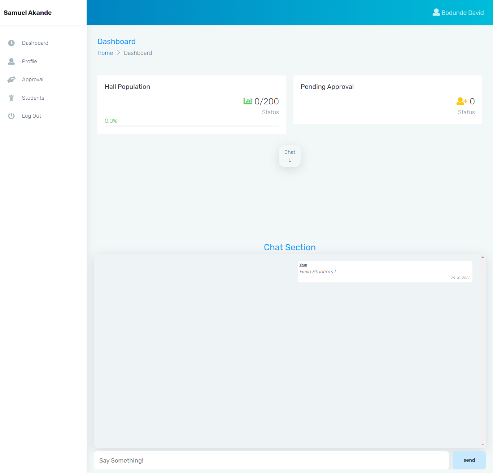

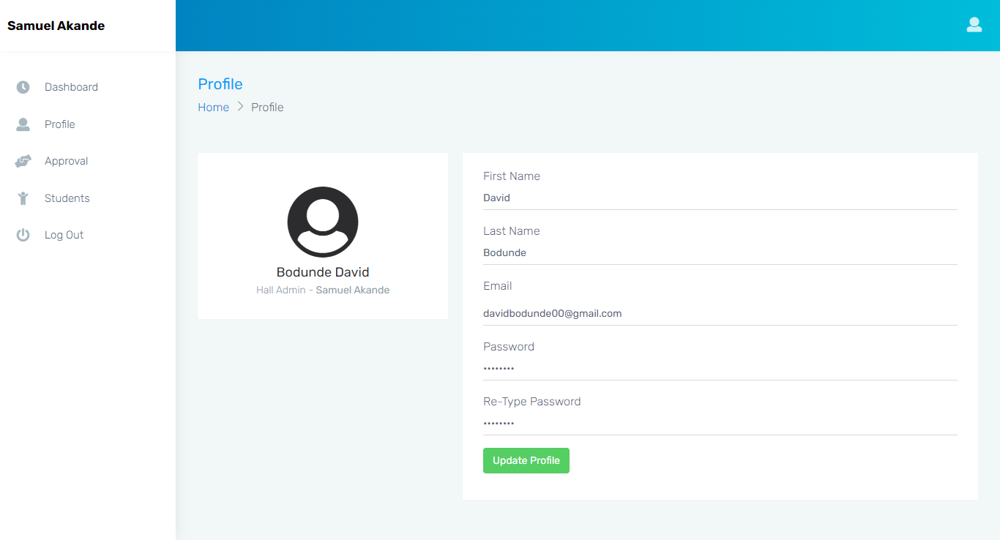


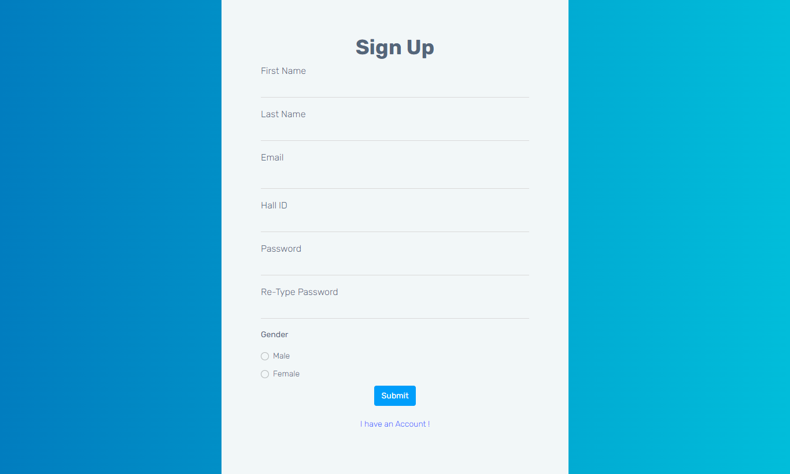

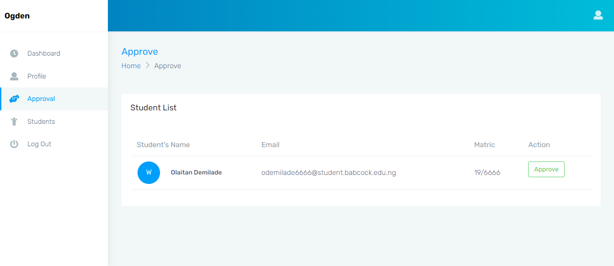

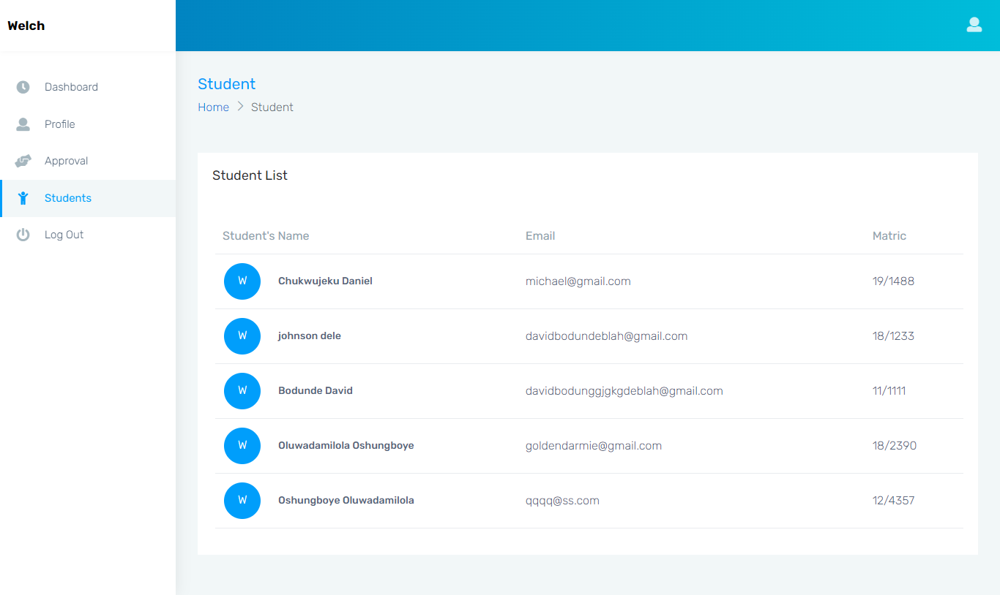

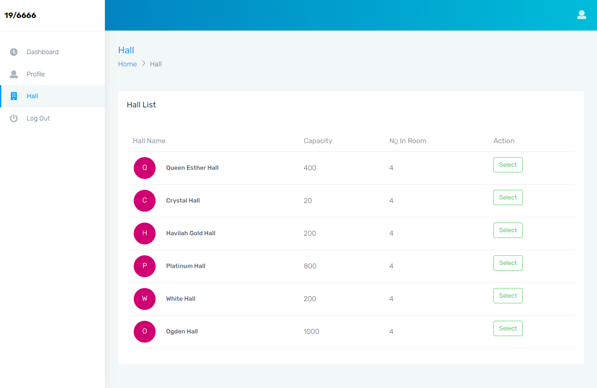

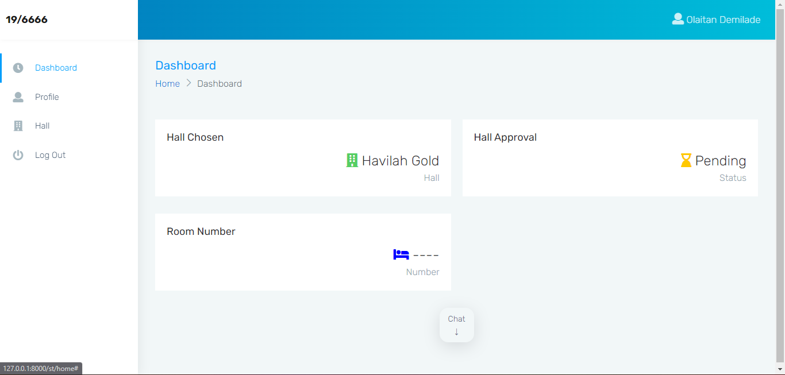

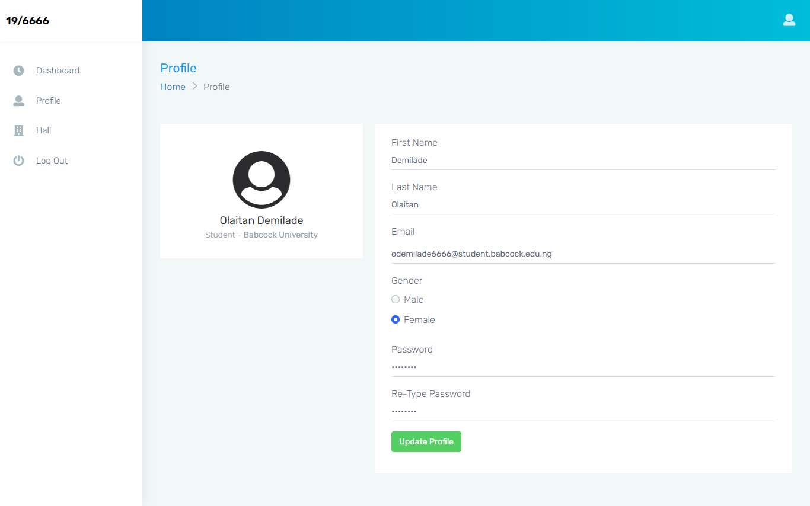

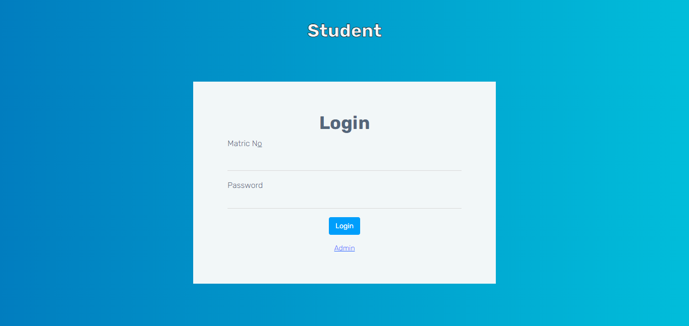

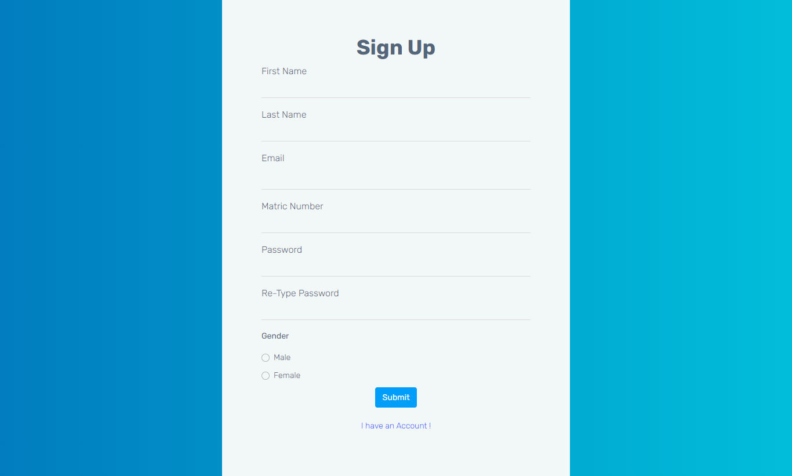

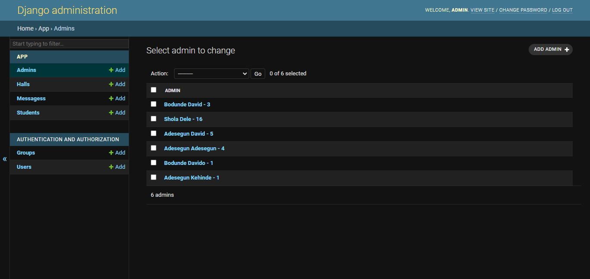

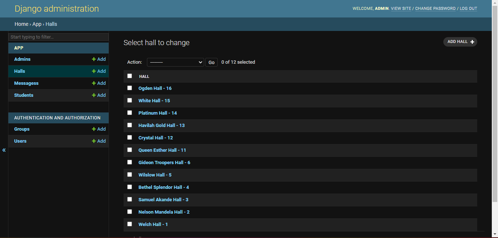

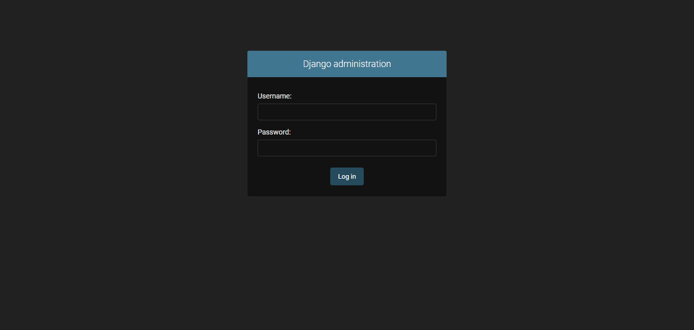

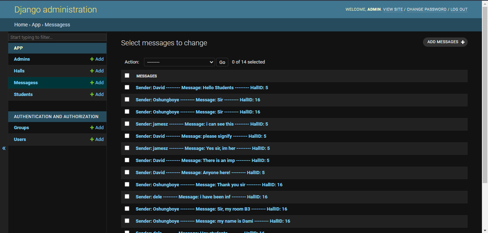

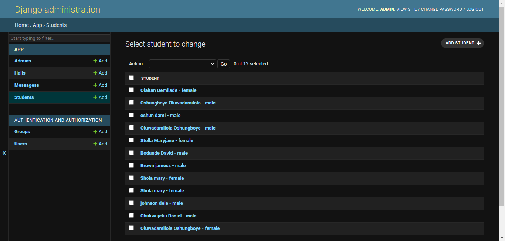
